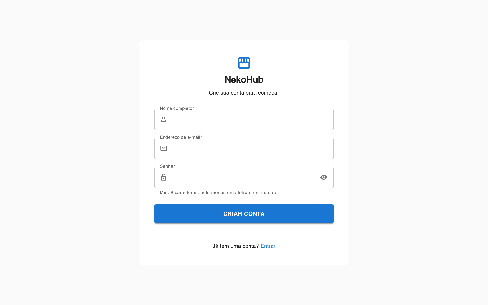
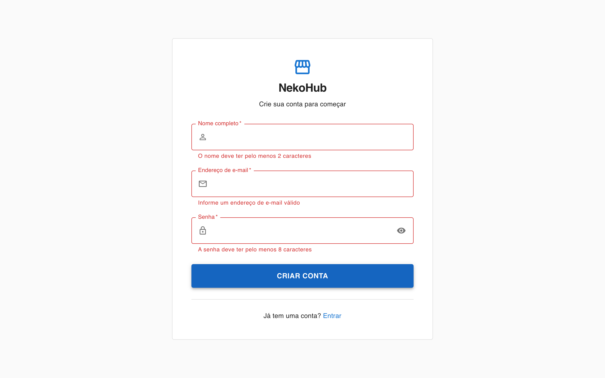
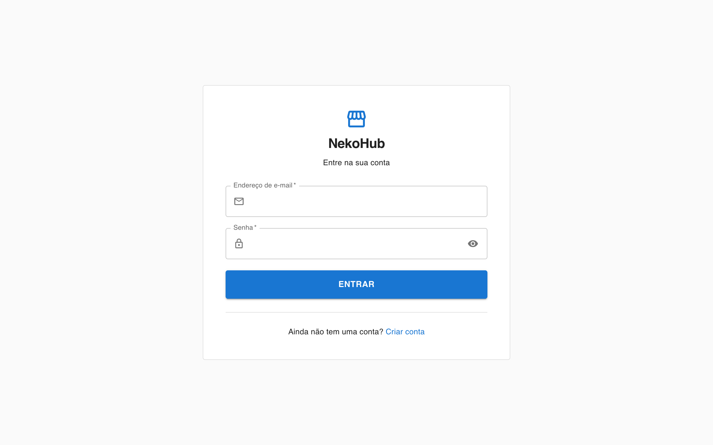
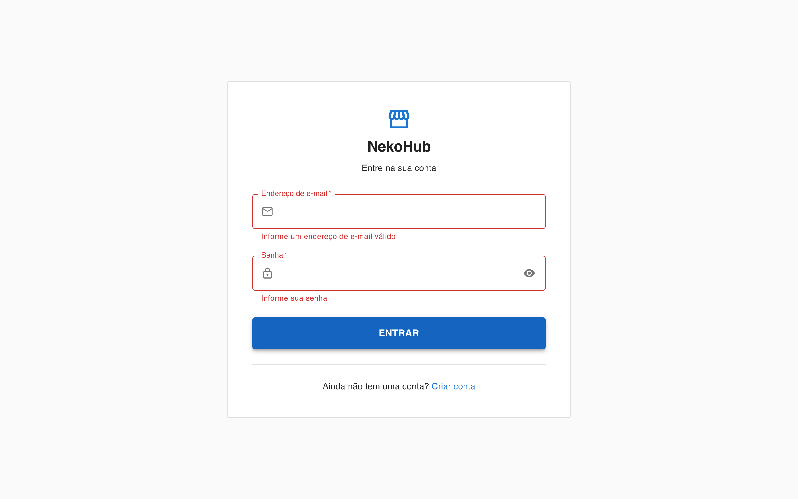
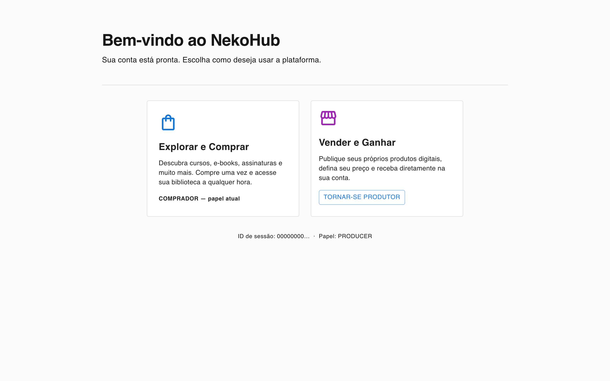

# NekoHub

Digital products marketplace — sell and buy courses, ebooks, memberships, software, and services.

## Screenshots

| Sign up                                   | Sign up (validation)                             |
| ----------------------------------------- | ------------------------------------------------ |
|  |  |

| Login                                   | Login (validation)                             |
| --------------------------------------- | ---------------------------------------------- |
|   |  |

| Dashboard                                      |
| ---------------------------------------------- |
|  |

## Stack

- **Next.js 16** (App Router) + **React 19**
- **TypeScript 5** (strict)
- **Prisma 7** + **Neon PostgreSQL** (serverless)
- **Stripe 22** — payments, Connect payouts, webhooks
- **Tailwind CSS v4**

## Getting Started

### 1. Environment

Copy `.env.example` to `.env.local` and fill in all values:

```bash
cp .env.example .env.local
```

| Variable                             | Description                     |
| ------------------------------------ | ------------------------------- |
| `DATABASE_URL`                       | Neon pooled connection string   |
| `STRIPE_SECRET_KEY`                  | `sk_test_…` or `sk_live_…`      |
| `NEXT_PUBLIC_STRIPE_PUBLISHABLE_KEY` | `pk_test_…` or `pk_live_…`      |
| `STRIPE_WEBHOOK_SECRET`              | `whsec_…` from Stripe dashboard |

### 2. Database

```bash
npx prisma migrate dev   # apply migrations + regenerate client
npx prisma studio        # browse data locally
```

### 3. Dev Server

```bash
npm run dev
```

Open [http://localhost:3000](http://localhost:3000).

### 4. Stripe Webhooks (local)

```bash
stripe listen --forward-to localhost:3000/api/stripe/webhook
```

## Key Scripts

| Script          | Purpose                  |
| --------------- | ------------------------ |
| `npm run dev`   | Start development server |
| `npm run build` | Production build         |
| `npm run lint`  | Run ESLint               |

## Docs

See [`docs/`](./docs/) for architecture, conventions, database, payments, testing, and CI/CD guides.

## Domain Overview

| Domain        | Description                            |
| ------------- | -------------------------------------- |
| Users         | Auth, roles (BUYER / PRODUCER / ADMIN) |
| Producers     | Stripe Connect, KYC, payout schedule   |
| Products      | Listings, pricing, content modules     |
| Orders        | Purchase lifecycle, fee breakdown      |
| Subscriptions | Recurring billing synced from Stripe   |
| Affiliates    | Referral codes, commission tracking    |
| Access        | Grants/revokes buyer product access    |
| Webhooks      | Idempotent Stripe event log            |
